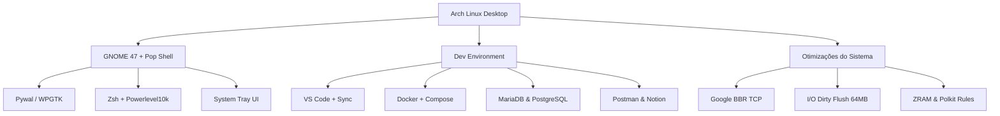

# 🌌 Arch Linux + GNOME Rice & Dev Environment

<div align="center">


<p align="center">
  <b>Um ambiente de desenvolvimento completo, ultrarrápido e altamente estilizado no Arch Linux com GNOME Shell, Tiling Window Management, Theming Dinâmico (Pywal/WPGTK), painel de serviços integrado e otimizações de Kernel de alta performance.</b>
</p>

[✨ Funcionalidades](#-principais-funcionalidades) •
[🚀 Instalação](#-instalação-rápida) •
[⌨️ Atalhos](#-atalhos-de-teclado-keybindings) •
[🛠️ Stack](#-stack-de-ferramentas) •
[🖥️ System Tray](#-system-tray--gerenciador-de-serviços) •
[🔄 Backup](#-sincronização-e-backup-contínuo)

---

</div>

## 📸 Demonstração (Showcase)

<div align="center">
  
</div>

<br>

> 🎥 **Vídeo de Demonstração Interativo:**
> *(Grave uma prévia rápida usando o gravador nativo do GNOME apertando `PrintScreen` > Modo Vídeo e arraste o arquivo `.webm` para cá!)*

---

## ✨ Principais Funcionalidades

### 🎨 1. Theming Dinâmico e Paleta Automática (Pywal / WPGTK)
* Paleta de 16 cores gerada instantaneamente a partir do wallpaper atual.
* Integração direta com **WezTerm**, **Alacritty**, **Cava**, **Fastfetch**, **Wofi** e **Wlogout**.
* Seletor rápido de wallpaper interativo acessível pelo atalho `Alt + W`.

### 🖥️ 2. System Tray & Gerenciador Dinâmico de Serviços (XAMPP-like)
* Painel de controle web integrado e ícone na barra superior (`AyatanaAppIndicator`).
* Controle em 1 clique para iniciar, parar e reiniciar serviços de desenvolvimento (**Docker**, **MariaDB**, **PostgreSQL**, **Hamachi**, etc.).
* Regra do **Polkit** dedicada que dispensa digitação repetitiva de senhas de sudo.

### ⚡ 3. Otimizações de Kernel & Responsividade (`/etc/sysctl.d`)
* **Gravação Contínua em Disco (Anti-Freeze):** Limites ajustados de I/O em blocos de 64MB (`vm.dirty_background_bytes`), eliminando travamentos durante downloads pesados (Steam, Chrome, Torrents).
* **Google BBR Congestion Control:** Protocolo de rede de última geração que reduz bufferbloat e acelera downloads.
* **Ajuste fino para ZRAM:** Evita fechamento inesperado de abas e stutters em jogos.

### 🐚 4. Shell Produtivo (ZSH + Powerlevel10k)
* Prompt informativo com status de branches Git, tempos de execução e pacotes.
* Plugins nativos: `zsh-autosuggestions`, `zsh-syntax-highlighting` e comandos rápidos.
* Aliases configurados para limpeza de cache do Arch, status de pacotes e atalhos de desenvolvimento.

### 🪟 5. Gerenciamento Inteligente de Janelas
* Janelas lado a lado e snapping avançado via **Tiling Assistant** e **Pop Shell**.
* Transparência adaptativa e cantos arredondados integrados.

### ☁️ 6. Nuvem e Arquivos sem Gargalos
* Montagem automatizada via **Rclone** (`GoogleDrive` e `DriveUnimar`) como serviços de usuário do systemd.
* Indexador Tracker3 do GNOME calibrado para ignorar pastas remotas, poupando CPU e memória RAM.

---

## ⌨️ Atalhos de Teclado (Keybindings)

| Atalho | Ação | Descrição / Comando |
| :--- | :--- | :--- |
| <kbd>Alt</kbd> + <kbd>Q</kbd> | **Terminal Principal** | Abre o terminal padrão estilizado com Pywal |
| <kbd>Super</kbd> + <kbd>T</kbd> | **WezTerm** | Abre o emulador de terminal WezTerm com GPU acceleration |
| <kbd>Super</kbd> + <kbd>E</kbd> | **Gerenciador de Arquivos** | Abre o Nautilus com pastas em português |
| <kbd>Alt</kbd> + <kbd>F</kbd> | **Menu de Aplicativos** | Launcher rápido via `Wofi` com busca dinâmica |
| <kbd>Alt</kbd> + <kbd>W</kbd> | **Seletor de Wallpaper** | Script interativo para troca instantânea de papel de parede |
| <kbd>Alt</kbd> + <kbd>L</kbd> | **Menu de Saída (Power)** | Menu estilizado `Wlogout` (Desligar, Reiniciar, Suspender, Bloquear) |
| <kbd>Super</kbd> + <kbd>N</kbd> | **Notas Rápidas** | Abre o bloco flutuante de anotações instantâneas |
| <kbd>Super</kbd> + <kbd>Setas</kbd> | **Tiling de Janelas** | Fixa e divide janelas nas metades ou quadrantes da tela |
| <kbd>PrintScreen</kbd> | **Captura / Gravação** | Ferramenta nativa do GNOME para foto ou vídeo de tela |

---

## 🛠️ Stack de Ferramentas



### 💻 Desenvolvimento & Banco de Dados
* **IDE & Editores:** Visual Studio Code (configurações, atalhos e extensões sincronizadas), Arduino IDE.
* **Bancos de Dados:** MariaDB (MySQL), PostgreSQL, MySQL Workbench.
* **Containers & API:** Docker, Docker Compose, Postman.
* **Linguagens & Runtimes:** Node.js, npm, Python 3, OpenJDK.

### 🎮 Launchers & Jogos
* **Steam** (Nativo com bibliotecas 32-bit e MangoHud)
* **Heroic Games Launcher** (Epic Games e GOG)
* **GameMode** e drivers Vulkan otimizados

### 🎵 Mídia, Comunicação & Utilitários
* **Comunicação:** Discord (com Vesktop / BetterDiscord), Google Chrome, Firefox.
* **Produtividade:** Notion (`notion-app-electron`), Remmina, Kolourpaint, Baobab.
* **Mídia & Gravação:** Spotify, OBS Studio, Cava (Audio Visualizer), VLC, Showtime.

---

## 🖥️ System Tray — Gerenciador de Serviços

O repositório inclui um gerenciador dedicado localizado em `~/system-tray`:

```bash
# Executar manualmente se necessário:
python3 ~/system-tray/app.py
```

* **Dashboard Web:** Acesse em `http://127.0.0.1:4999` para gerenciar qualquer serviço do Linux, criar favoritos e monitorar portas em execução.
* **Bandeja Superior:** Ícone interativo para iniciar/parar servidores locais em milissegundos.

---

## 🚀 Instalação Rápida

Para replicar exatamente este ambiente em qualquer instalação limpa do Arch Linux (com GNOME):

```bash
# 1. Instale o git
sudo pacman -S --needed git

# 2. Clone este repositório
git clone https://github.com/Viniciusulpicio/dotfiles-arch.git ~/dotfiles-arch

# 3. Entre na pasta e execute o instalador
cd ~/dotfiles-arch
chmod +x install.sh
./install.sh
```

### ☕ O que o instalador faz sozinho:
1. Ativa o repositório `[multilib]` e configura o idioma do sistema para **Português (pt_BR.UTF-8)**.
2. Organiza as pastas padrão em português (`Área de trabalho`, `Documentos`, `Downloads`, etc.).
3. Instala o **Yay-bin** instantaneamente sem timeouts.
4. Instala todos os pacotes oficiais e pacotes do AUR.
5. Restaura dotfiles (`.zshrc`, `.p10k.zsh`, `.bashrc`, etc.), `.config/` e temas.
6. Carrega o banco de configurações do GNOME (`Dconf`), atalhos e temas de ícones.
7. Instala as extensões do GNOME e compila os schemas.
8. Configura permissões do **Polkit** e parâmetros de alta velocidade no **Kernel**.
9. Habilita Docker, Bluetooth, NetworkManager e bancos de dados.

---

## 🔄 Sincronização e Backup Contínuo

Sempre que fizer alterações no seu tema, atalhos, extensões ou configurações e quiser salvar no GitHub:

```bash
cd ~/dotfiles-arch
./backup_rice.sh
git add .
git commit -m "Meu novo ajuste no Rice"
git push origin main
```

---

<div align="center">
  <sub>Criado e mantido por <b>Vinicius Sulpicio</b>. Feito com foco em performance, estética e produtividade.</sub>
</div>
