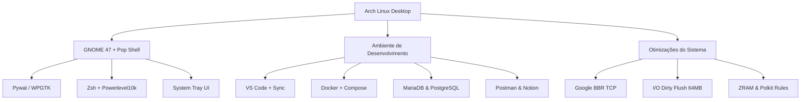

# Arch Linux + GNOME Rice & Dev Environment

<div align="center">


<p align="center">
  <b>Ambiente de desenvolvimento completo e configurado no Arch Linux com GNOME Shell, Tiling Window Management, Theming Dinâmico (Pywal/WPGTK), painel de serviços integrado e otimizações de Kernel de alta performance.</b>
</p>

[Funcionalidades](#principais-funcionalidades) •
[Instalação](#instalacao-rapida) •
[Atalhos](#atalhos-de-teclado-keybindings) •
[Stack](#stack-de-ferramentas) •
[System Tray](#system-tray--gerenciador-de-servicos) •
[Backup](#sincronizacao-e-backup-continuo)

---

</div>

## Demonstração (Showcase)

<div align="center">
  
</div>

<br>

> **Vídeo de Demonstração Interativo:**
> *(Para adicionar uma prévia em vídeo, utilize o gravador de tela nativo do GNOME através da tecla PrintScreen em Modo Vídeo e anexe o arquivo .webm aqui)*

---

## Principais Funcionalidades

### 1. Theming Dinâmico e Paleta Automática (Pywal / WPGTK)
* Paleta de 16 cores gerada automaticamente a partir do wallpaper atual.
* Integração direta com WezTerm, Alacritty, Cava, Fastfetch, Wofi e Wlogout.
* Seletor interativo de wallpaper acessível via atalho `Alt + W`.

### 2. System Tray & Gerenciador Dinâmico de Serviços
* Painel de controle web integrado e ícone na barra superior via AyatanaAppIndicator.
* Controle centralizado para iniciar, parar e reiniciar serviços de desenvolvimento (Docker, MariaDB, PostgreSQL, Hamachi, etc.).
* Regra do Polkit dedicada que dispensa a necessidade de senhas de sudo repetitivas.

### 3. Otimizações de Kernel & Responsividade (/etc/sysctl.d)
* **Gravação Contínua em Disco:** Limites de I/O em blocos de 64MB (`vm.dirty_background_bytes`), prevenindo travamentos durante downloads pesados (Steam, navegadores, torrents).
* **Google BBR Congestion Control:** Algoritmo TCP moderno para menor latência e maior velocidade de rede.
* **Calibração de ZRAM:** Configuração de memória otimizada para evitar encerramento inesperado de processos e travamentos em jogos.

### 4. Shell Produtivo (ZSH + Powerlevel10k)
* Prompt informativo com status de branches Git, tempos de execução e pacotes.
* Plugins integrados: autosugestões (`zsh-autosuggestions`), syntax highlighting (`zsh-syntax-highlighting`) e histórico pesquisável.
* Aliases configurados para manutenção de pacotes e atalhos de desenvolvimento.

### 5. Gerenciamento de Janelas (Tiling)
* Janelas lado a lado e divisão inteligente da tela via Tiling Assistant e Pop Shell.
* Transparência adaptativa e bordas integradas ao tema.

### 6. Integração com Armazenamento em Nuvem
* Montagem automatizada via Rclone (`GoogleDrive` e `DriveUnimar`) como serviços de usuário do systemd.
* Indexador Tracker3 do GNOME calibrado para ignorar pastas remotas, economizando processamento e memória RAM.

---

## Atalhos de Teclado (Keybindings)

| Atalho | Ação | Descrição / Comando |
| :--- | :--- | :--- |
| <kbd>Alt</kbd> + <kbd>Q</kbd> | **Terminal Principal** | Abre o terminal padrão com tema Pywal |
| <kbd>Super</kbd> + <kbd>T</kbd> | **WezTerm** | Abre o emulador de terminal WezTerm com aceleração por hardware |
| <kbd>Super</kbd> + <kbd>E</kbd> | **Gerenciador de Arquivos** | Abre o Nautilus com diretórios padrão organizados |
| <kbd>Alt</kbd> + <kbd>F</kbd> | **Menu de Aplicativos** | Launcher rápido via Wofi com pesquisa dinâmica |
| <kbd>Alt</kbd> + <kbd>W</kbd> | **Seletor de Wallpaper** | Script interativo para troca rápida de papel de parede |
| <kbd>Alt</kbd> + <kbd>L</kbd> | **Menu de Saída (Power)** | Menu Wlogout (Desligar, Reiniciar, Suspender, Bloquear) |
| <kbd>Super</kbd> + <kbd>N</kbd> | **Notas Rápidas** | Abre bloco flutuante para anotações instantâneas |
| <kbd>Super</kbd> + <kbd>Setas</kbd> | **Tiling de Janelas** | Divide janelas nas metades ou quadrantes da tela |
| <kbd>PrintScreen</kbd> | **Captura / Gravação** | Ferramenta do GNOME para imagem ou gravação de vídeo da tela |

---

## Stack de Ferramentas



### Desenvolvimento & Banco de Dados
* **IDE & Editores:** Visual Studio Code (configurações, atalhos e extensões sincronizadas), Arduino IDE.
* **Bancos de Dados:** MariaDB (MySQL), PostgreSQL, MySQL Workbench.
* **Containers & API:** Docker, Docker Compose, Postman.
* **Linguagens & Runtimes:** Node.js, npm, Python 3, OpenJDK.

### Launchers & Jogos
* **Steam** (Nativo com bibliotecas 32-bit e MangoHud)
* **Heroic Games Launcher** (Epic Games e GOG)
* **GameMode** e drivers Vulkan otimizados

### Mídia, Comunicação & Utilitários
* **Comunicação:** Discord (com Vesktop / BetterDiscord), Google Chrome, Firefox.
* **Produtividade:** Notion (`notion-app-electron`), Remmina, Kolourpaint, Baobab.
* **Mídia & Gravação:** Spotify, OBS Studio, Cava (Audio Visualizer), VLC, Showtime.

---

## System Tray — Gerenciador de Serviços

O repositório inclui um gerenciador dedicado localizado em `~/system-tray`:

```bash
# Execução manual:
python3 ~/system-tray/app.py
```

* **Dashboard Web:** Acesse em `http://127.0.0.1:4999` para gerenciar serviços do Linux, configurar favoritos e monitorar portas ativas.
* **Bandeja Superior:** Ícone interativo para alternar o estado de servidores locais rapidamente.

---

## Instalação Rápida

Para replicar este ambiente em uma instalação limpa do Arch Linux (com GNOME):

```bash
# 1. Instalar o git
sudo pacman -S --needed git

# 2. Clonar o repositório
git clone https://github.com/Viniciusulpicio/dotfiles-arch.git ~/dotfiles-arch

# 3. Executar o instalador
cd ~/dotfiles-arch
chmod +x install.sh
./install.sh
```

### O que o instalador automatiza:
1. Ativa o repositório `[multilib]` e configura o idioma do sistema para **Português (pt_BR.UTF-8)**.
2. Organiza as pastas padrão em português (`Área de trabalho`, `Documentos`, `Downloads`, etc.).
3. Instala o **Yay-bin** de forma otimizada.
4. Instala todos os pacotes oficiais e pacotes do AUR.
5. Restaura arquivos de perfil (`.zshrc`, `.p10k.zsh`, `.bashrc`, etc.), `.config/` e temas.
6. Aplica o banco de configurações do GNOME (Dconf), atalhos e temas de ícones.
7. Instala as extensões do GNOME e compila os schemas necessários.
8. Configura regras do **Polkit** e parâmetros de responsividade no **Kernel**.
9. Habilita Docker, Bluetooth, NetworkManager e bancos de dados.

---

## Sincronização e Backup Contínuo

Para salvar alterações feitas no tema, atalhos, extensões ou configurações no GitHub:

```bash
cd ~/dotfiles-arch
./backup_rice.sh
git add .
git commit -m "Atualização de configurações do ambiente"
git push origin main
```

---

<div align="center">
  <sub>Criado e mantido por <b>Vinicius Sulpicio</b>. Foco em estabilidade, produtividade e performance.</sub>
</div>
